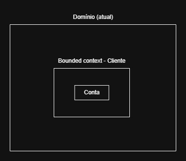

# Sistema Monolítico Banco | Projeto de Bloco: Engenharia de Softwares Escaláveis

### Apresentação e Documentação:
Esta é a aplicação de um banco fictício, que contém um CRUD feito em Java com Spring Boot e outras tecnologias. A seguir são os comportamentos esperados do software:

* C -> Adicionar nova conta dentro do banco de dados do banco.
* R -> Obter dados de uma ou várias contas. 
* U -> Editar saldo de uma conta já existente.
* D -> Remover uma conta via ID.

Padrão utilizado: Controller-Service-Repository.

Princípio de projeto: DDD.

### Diagrama de Componentes:

### Diagrama de Sequência:

### Diagrama do Domínio Atual do Banco (com potencial para expansões):

### Vídeo de Demonstração através de Testes de Uso com JUnit:

